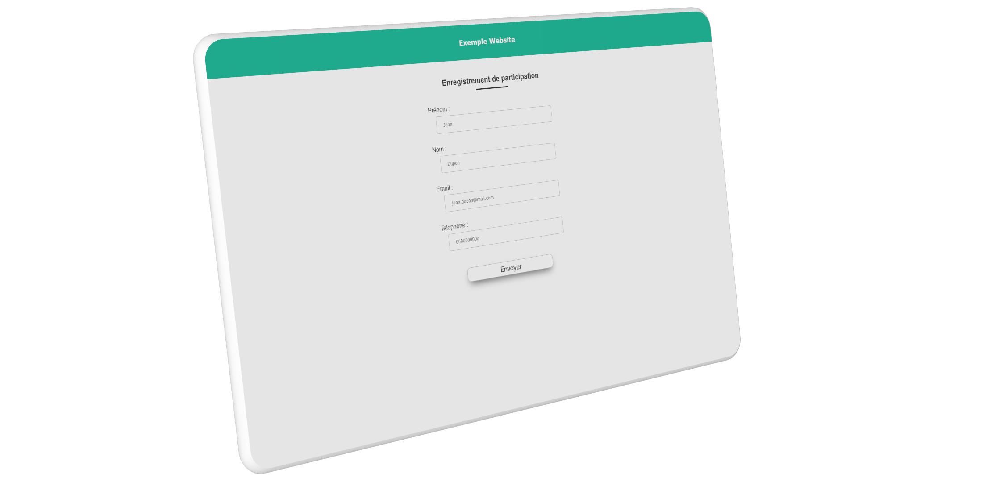

# Simple PHP Email Registration + Validation

<center>
	
</center>

- ## Description :

This is an exemple of app where peoples can add informations and get a confimation email to participe to an event by exemple. 

- ## Requirements :

  - Apache server
  - Install database
  - Config `functs_db.php`

- ## Config database :

  - Open `/api/includes/functs_db.php` and `/includes/functs_db.php`

  - And edit with yours creditials : 
    ```
    "host" => "localhost",
    "dbusername" => "root",
    "dbpassword" => ""
    ```

- ## Default user to login page :
  - username : `Test`
  - password : `Test`

- ## Pages :
  - /Inscription : Register a account
  - /Validation : Valid code send by email
  - /Admin : Admin board (view registerd account)
  - /Login : Login to admin board.